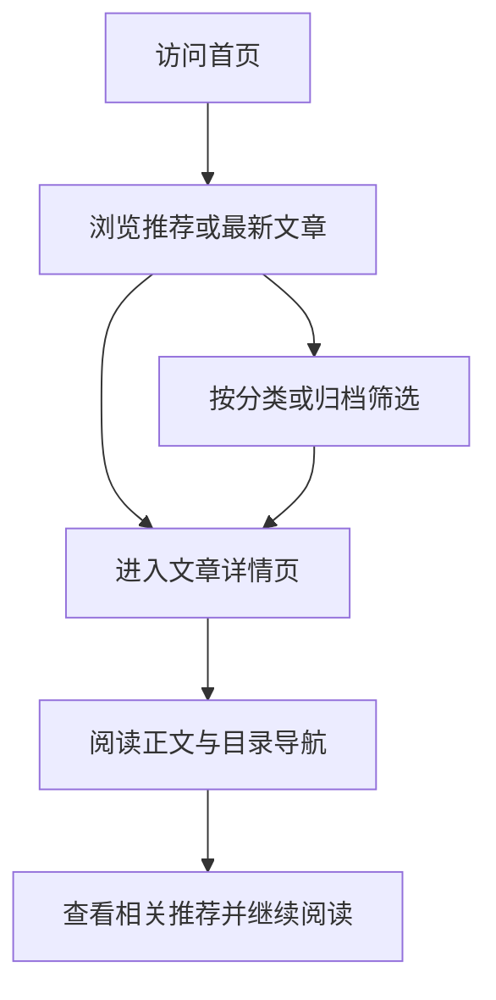

## 1. Product Overview
这是一个面向个人创作者的博客网站，帮助用户发布、分类、检索与浏览文章内容。  
产品目标是以高可读性与高表达力的界面提升内容传播效率与个人品牌展示效果。

## 2. Core Features

### 2.1 Feature Module
1. **首页**：品牌介绍、推荐文章、最新文章列表、分类入口  
2. **文章详情页**：正文阅读、目录导航、相关推荐、分享入口  
3. **归档与分类页**：按分类与时间维度浏览文章

### 2.2 Page Details
| Page Name | Module Name | Feature description |
|-----------|-------------|---------------------|
| 首页 | 顶部导航 | 提供首页、分类、归档跳转与品牌标识展示 |
| 首页 | Hero 区域 | 展示博客定位、核心价值与行动按钮 |
| 首页 | 推荐文章区 | 卡片化展示精选内容与摘要信息 |
| 首页 | 最新文章列表 | 按发布时间倒序展示文章，支持快速进入详情 |
| 首页 | 分类入口 | 展示分类标签与对应文章数量 |
| 文章详情页 | 文章头图与元信息 | 展示标题、发布日期、阅读时长、分类信息 |
| 文章详情页 | 正文内容区 | 呈现完整文章内容，优化段落、代码块与引用可读性 |
| 文章详情页 | 目录导航 | 根据标题层级生成目录，支持快速定位段落 |
| 文章详情页 | 相关推荐 | 基于分类推荐相关文章提升阅读深度 |
| 归档与分类页 | 分类筛选区 | 按分类过滤文章并展示统计信息 |
| 归档与分类页 | 时间归档区 | 按年月归档文章并支持跳转详情 |

## 3. Core Process
用户进入首页后可先浏览推荐内容或通过分类入口筛选文章，再进入详情页完成深度阅读，并通过相关推荐继续探索更多内容。  
创作者通过维护文章数据即可在首页、分类与归档页面形成统一的信息分发路径。

## 4. User Interface Design
### 4.1 Design Style
- 主色采用暖白与墨黑，强调内容可读性；辅助色采用铜金与深蓝用于层级与交互强调  
- 按钮风格采用圆角实心与描边组合，主按钮突出、次按钮克制  
- 标题字体使用高识别度衬线字体，正文字体使用清晰的人文无衬线字体  
- 布局以桌面端多栏阅读结构为主，首页采用卡片网格与留白并重  
- 图标风格采用线性图标搭配少量装饰性符号，保持信息密度与视觉节奏平衡

### 4.2 Page Design Overview
| Page Name | Module Name | UI Elements |
|-----------|-------------|-------------|
| 首页 | Hero 区域 | 大字号标题、副标题、主行动按钮、柔和渐变背景与入场动画 |
| 首页 | 推荐文章区 | 高对比卡片、悬停阴影提升、摘要与标签组合排版 |
| 文章详情页 | 正文内容区 | 优化行宽、段落间距、代码块高亮背景与引用样式 |
| 文章详情页 | 目录导航 | 固定侧边栏、当前章节高亮、平滑滚动定位 |
| 归档与分类页 | 时间归档区 | 时间轴样式列表、分组标题与折叠展开动效 |

### 4.3 Responsiveness
采用桌面优先设计：桌面端使用双栏或三栏布局提升信息浏览效率；平板端收敛为双栏结构；移动端自动折叠侧栏与目录，改为单栏流式阅读并优化触控点击区域。
