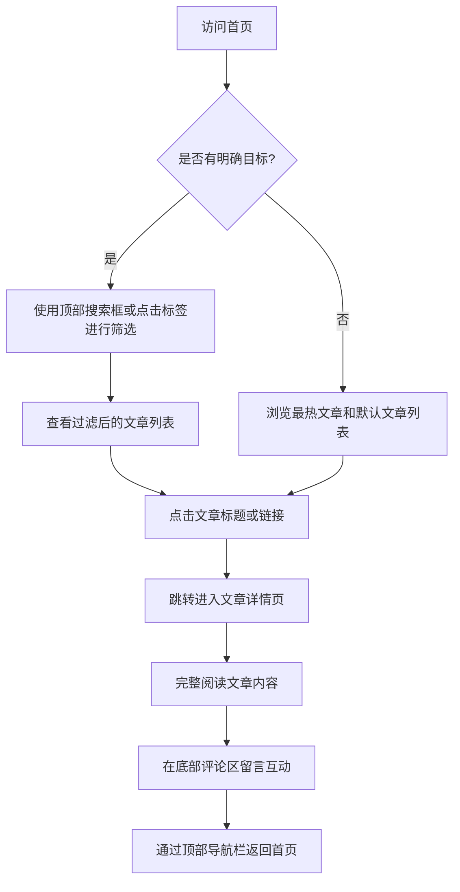

## 1. 产品概述
这是一个具有“科技感”设计的个人博客网站，旨在展示博主的文章，并提供流畅的用户阅读和互动体验。
- 主要解决内容展示与检索的问题，为目标用户（技术爱好者、开发者等）提供一个极具未来感和极客风格的阅读空间。
- 通过高颜值的设计和便捷的交互（搜索、标签筛选、留言互动），提升博客的吸引力和用户留存率。

## 2. 核心功能

### 2.1 用户角色
| 角色 | 注册方式 | 核心权限 |
|------|----------|----------|
| 访客 | 无需注册 | 浏览文章、按标签/关键字搜索文章、在详情页发表评论互动 |

### 2.2 功能模块
1. **首页**：顶部导航与搜索、标签筛选区、最热文章高亮区、文章列表区
2. **详情页**：简洁导航栏、文章全文展示区、用户评论互动区

### 2.3 页面详情
| 页面名称 | 模块名称 | 功能描述 |
|----------|----------|----------|
| 首页 | 顶部导航与搜索 | 包含全局关键字搜索框；包含网站 Logo 或返回首页的链接。 |
| 首页 | 标签筛选区 | 提供一系列分类标签，用户点击后可按标签筛选显示文章列表。 |
| 首页 | 最热文章区 | 突出显示点赞量最高的文章的标题和摘要，吸引用户点击阅读。 |
| 首页 | 文章列表区 | 展示常规文章卡片，包含标题、摘要、标签等信息，点击跳转至详情页。 |
| 详情页 | 导航栏 | 提供简洁的导航栏，方便用户在详情页和首页之间流畅切换。 |
| 详情页 | 文章正文区 | 完整展示文章内容，排版清晰，符合科技感风格。 |
| 详情页 | 评论互动区 | 用户可以输入昵称和评论内容进行留言，页面展示历史评论列表。 |

## 3. 核心流程
用户浏览与互动的主流程：

## 4. UI/UX 设计
### 4.1 设计风格
- **主色调与强调色**：采用暗黑科技风（Dark Mode）。背景色使用深空黑（如 `#0A0A0A` 或深蓝灰 `#0F172A`），强调色使用霓虹青（Cyan `#00F0FF`）和赛博紫（Purple `#8B5CF6`）。
- **按钮与控件样式**：带微发光（Glow）效果的边框，悬浮时有明显的色彩渐变和霓虹反光；输入框采用半透明磨砂质感（Glassmorphism）。
- **字体**：标题和导航使用现代无衬线字体（如 Inter 或 Roboto），标签和代码元素使用等宽字体（如 JetBrains Mono），增强极客感。
- **布局风格**：卡片式布局，背景带有细微的科技感网格线（Grid）或点阵背景，卡片之间保持充足的留白。
- **动效**：页面切换和元素悬浮时，带有平滑的呼吸灯效果或发光边框流转动效。

### 4.2 页面设计概览
| 页面名称 | 模块名称 | UI 元素 |
|----------|----------|---------|
| 首页 | 导航及搜索 | 吸顶的半透明玻璃态导航栏，搜索框聚焦时边框发光并带有平滑过渡。 |
| 首页 | 热门文章卡片 | 尺寸更大，带有特殊的渐变发光边框，视觉上形成“Top 1”的绝对焦点。 |
| 首页 | 标签与列表 | 标签为药丸形状，选中时高亮发光；文章列表卡片悬浮时有轻微上浮和阴影加深效果。 |
| 详情页 | 文章排版 | 高对比度的文字颜色（如亮灰），段落间距宽松，标题带有科技感的左侧高亮装饰线。 |

### 4.3 响应式设计
- 桌面端优先，宽屏下展现最佳的网格背景和发光特效。
- 移动端自适应，导航栏在小屏幕下精简，搜索框和标签栏支持横向滚动或折叠，确保多端阅读体验一致。