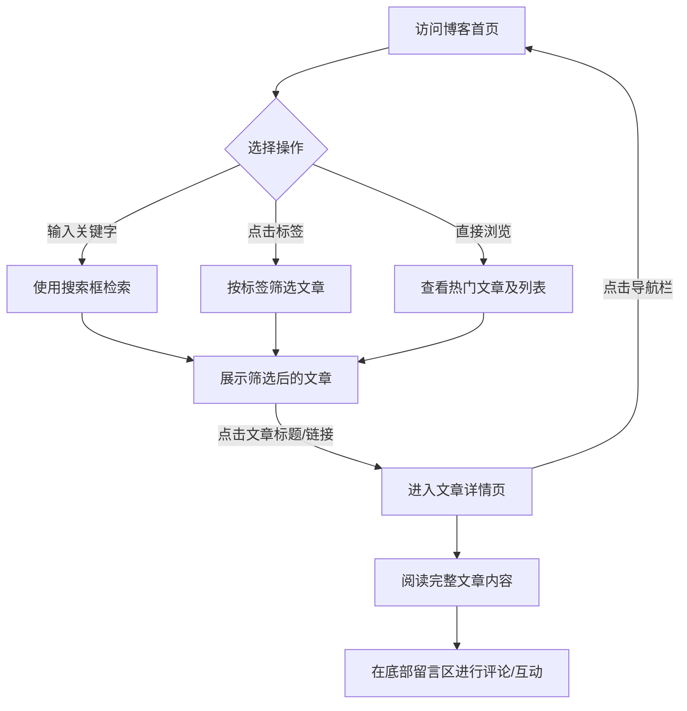

## 1. 产品概述
设计并创建一个具有现代“科技感”的个人博客网站，为博主提供技术文章展示和分享的平台，同时为读者提供高效的检索和互动体验。
- 主要解决技术博主的知识沉淀、内容展示及与读者的技术交流互动需求。
- 目标用户为开发者、技术爱好者以及寻找技术解决方案的互联网从业者。
- 网站不仅需要具备完整的博客功能（搜索、筛选、阅读、评论），还要在视觉设计上突出前沿科技的氛围（如深色模式、赛博朋克风或极简未来风的元素）。

## 2. 核心功能

### 2.1 用户角色
| 角色 | 注册方式 | 核心权限 |
|------|---------------------|------------------|
| 访客 | 无需注册 | 浏览文章、使用搜索与标签筛选、查看和发表评论（可使用匿名或快捷名称） |

### 2.2 功能模块
1. **首页 (Home Page)**：顶部导航与搜索框、标签筛选区、热门文章展示区（按点赞量排行）、文章列表区。
2. **详情页 (Details Page)**：简洁导航栏、文章全文展示区、点赞与评论互动区。

### 2.3 页面详情
| 页面名称 | 模块名称 | 功能描述 |
|-----------|-------------|---------------------|
| 首页 | 顶部导航与搜索 | 包含网站Logo/名称，右侧提供全局搜索框，支持关键字实时搜索文章。 |
| 首页 | 标签筛选器 | 提供热门技术标签（如 React, AI, Node.js 等），点击后筛选对应的文章列表。 |
| 首页 | 热门文章区 | 突出显示点赞量最高的几篇文章，展示标题和摘要，吸引用户点击。 |
| 首页 | 文章列表 | 瀑布流或卡片式展示所有文章（标题、摘要、日期、标签、点赞数），点击跳转详情。 |
| 详情页 | 简洁导航栏 | 提供返回首页、面包屑导航或快速跳转其他核心板块的链接，支持页面间流畅切换。 |
| 详情页 | 文章内容区 | 完整渲染 Markdown 格式的文章内容，支持代码高亮、科技感排版。 |
| 详情页 | 互动评论区 | 允许用户在文章底部留言评论，实现读者与博主或读者之间的互动功能。 |

## 3. 核心流程
用户进入首页，可以通过搜索框或标签筛选感兴趣的技术文章，或者直接点击最受欢迎的热门文章。点击文章标题后，流畅跳转至详情页阅读全文并参与评论互动，随后可通过顶部导航随时返回首页或继续浏览。

## 4. 用户界面设计

### 4.1 设计风格
- **整体风格**：现代科技感（Cyber/Tech-minimalism），注重界面层级和光影细节。
- **主次颜色**：
  - 背景色：深色主题（如 深邃黑 `#0A0A0F` 或 深空灰 `#121218`）。
  - 主题色/点缀色：荧光蓝 (`#00F0FF`) 或 霓虹紫 (`#B026FF`)，用于高亮、按钮、链接和发光效果。
  - 文字颜色：高对比度的浅灰白色，以确保长时间阅读的舒适性。
- **按钮与控件**：带有细微边框和背景发光（Glow）效果的扁平化/玻璃拟物化设计。
- **字体与排版**：
  - 标题使用具有几何感的无衬线字体（如 Orbitron, Space Grotesk 或 Roboto Mono）。
  - 正文使用易读的无衬线字体（如 Inter, 思源黑体）。
- **动效与交互**：
  - 页面加载和路由切换时使用平滑的渐隐渐现（Fade in/out）过渡。
  - 卡片悬浮时有轻微的上浮和边框霓虹发光效果（Hover glow effect）。

### 4.2 页面设计总览
| 页面名称 | 模块名称 | UI 元素及效果 |
|-----------|-------------|-------------|
| 首页 | 顶部导航栏 | 毛玻璃效果（Glassmorphism）吸顶导航，包含发光搜索框输入组件。 |
| 首页 | 标签筛选区 | 胶囊状按钮（Pill buttons），选中状态呈现霓虹高亮。 |
| 首页 | 热门文章 | 大面积的玻璃质感卡片，带有科技感网格背景或粒子效果，醒目的标题和点赞图标。 |
| 详情页 | 文章渲染区 | 科技感排版，代码块带有深色主题和语法高亮，引用块左侧有霓虹边框。 |
| 详情页 | 评论区 | 极简的输入框，发送按钮带有脉冲发光动效，评论列表以科技感对话框形式排列。 |

### 4.3 响应式设计
- **优先策略**：桌面端优先设计（Desktop-first），兼顾移动端适配。
- **布局自适应**：首页文章列表在桌面端为多列网格/瀑布流布局，在平板和手机端自动折叠为单列。
- **导航适配**：在移动端，搜索框和标签筛选器可收起至汉堡菜单或水平滑动展示，确保屏幕空间的高效利用。
