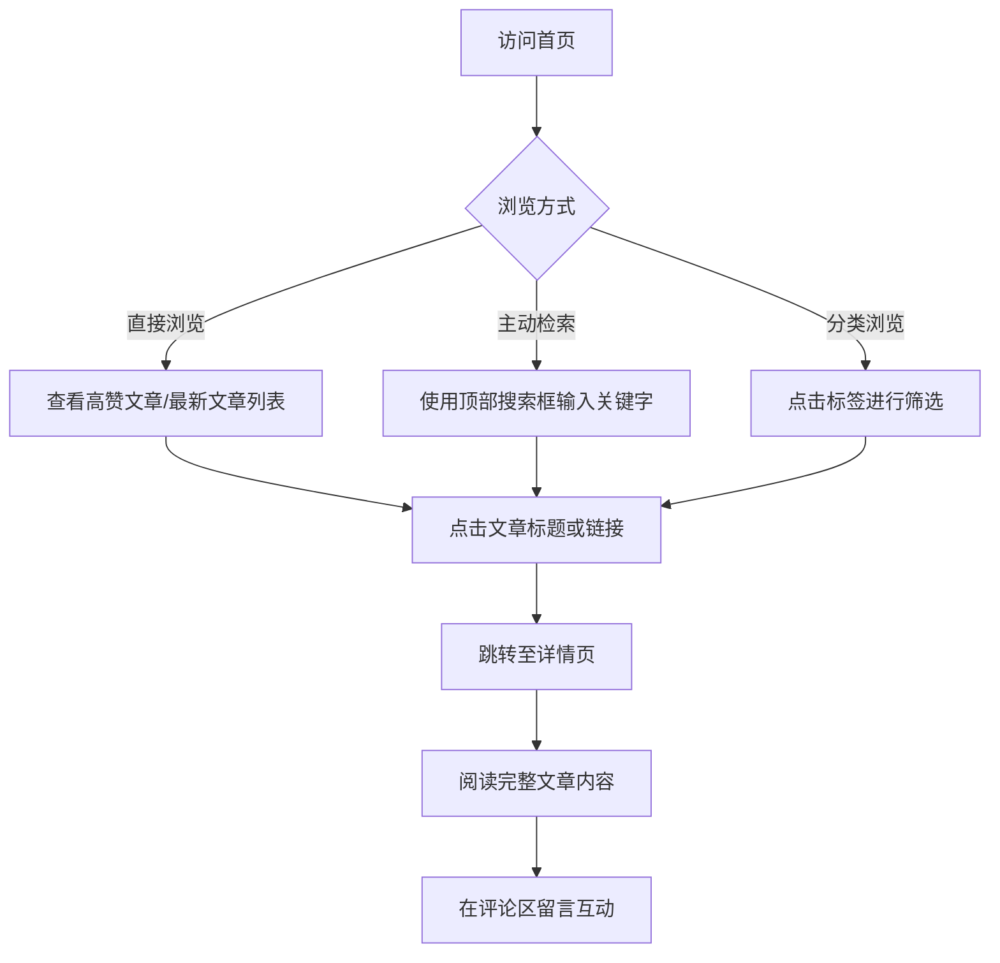

## 1. 产品概述
这是一款面向个人的科技感博客网站。
旨在为博主提供一个炫酷的、充满未来感的文章展示平台，同时支持用户通过搜索、标签过滤文章，并在详情页进行阅读和留言互动。

## 2. 核心功能

### 2.1 用户角色
| 角色 | 注册方式 | 核心权限 |
|------|----------|----------|
| 访客 | 无需注册 | 浏览文章、使用搜索和筛选、在详情页留言评论 |

### 2.2 功能模块
1. **首页**: 顶部导航、搜索框、标签筛选、高赞文章推荐位（展示标题和摘要）、文章列表展示。
2. **详情页**: 文章完整内容展示、返回与导航功能、评论互动区。

### 2.3 页面详情
| 页面名称 | 模块名称 | 功能描述 |
|----------|----------|----------|
| 首页 | 导航栏 | 包含Logo、全局搜索框、标签筛选入口（或直接在页面中展示） |
| 首页 | 高赞文章推荐 | 醒目位置展示当前点赞量最高的文章标题、摘要、封面图，点击可进入详情页 |
| 首页 | 文章列表 | 以科技感卡片形式列出最新文章，支持按标签或搜索关键字动态过滤 |
| 详情页 | 文章正文 | 完整排版的文章内容，包含代码高亮等适合科技博客的展示效果 |
| 详情页 | 评论区 | 允许用户输入昵称和内容进行留言，展示历史评论列表 |
| 全局 | 导航栏 | 悬浮或固定的简洁导航栏，方便用户随时返回首页或切换分类 |

## 3. 核心流程
用户核心操作流程：

## 4. 用户界面设计
### 4.1 设计风格
- **整体风格**: 科技感 (Tech-Savvy / Cyberpunk / Futuristic Minimalist)，以深色模式为基调。
- **主色调**: 深邃黑 (Dark Obsidian, #0F172A) 和 极客蓝/青色 (Cyan/Neon Blue, #06B6D4 / #3B82F6) 作为主视觉色。
- **点缀色**: 霓虹紫 (Neon Purple) 或 荧光绿 (Neon Green) 用于强调高赞、标签或按钮交互。
- **字体与大小**: 使用无衬线字体（如 Inter, Roboto Mono 增加代码感），大标题粗细分明，正文清晰易读。
- **布局风格**: 卡片式布局，大量运用玻璃拟态 (Glassmorphism)、细微的发光边框 (Glow borders)、网格背景 (Grid background) 增加科技氛围。
- **动效**: 页面切换、悬浮卡片时的平滑过渡与微小的光晕跟随效果。

### 4.2 页面设计概览
| 页面名称 | 模块名称 | UI 元素与样式 |
|----------|----------|---------------|
| 首页 | 顶部搜索导航 | 半透明磨砂玻璃背景，发光搜索框边框，霓虹色聚焦状态 |
| 首页 | 高赞推荐区 | 大尺寸科技感卡片，背景带有动态光效或渐变网格，文字带发光阴影 |
| 首页 | 标签筛选器 | 胶囊状按钮，选中时填充霓虹主题色并带有呼吸灯效果 |
| 详情页 | 文章容器 | 居中排版，深色阅读背景，高对比度文字，代码块带暗黑主题高亮 |
| 详情页 | 留言板 | 极简的输入框设计，带科技感的“发送”按钮，评论列表以轻量级卡片展示 |

### 4.3 响应式设计
采用桌面端优先策略，同时完美适配移动端（手机平板上搜索框可折叠，文章列表转为单列，导航栏适配汉堡菜单）。
