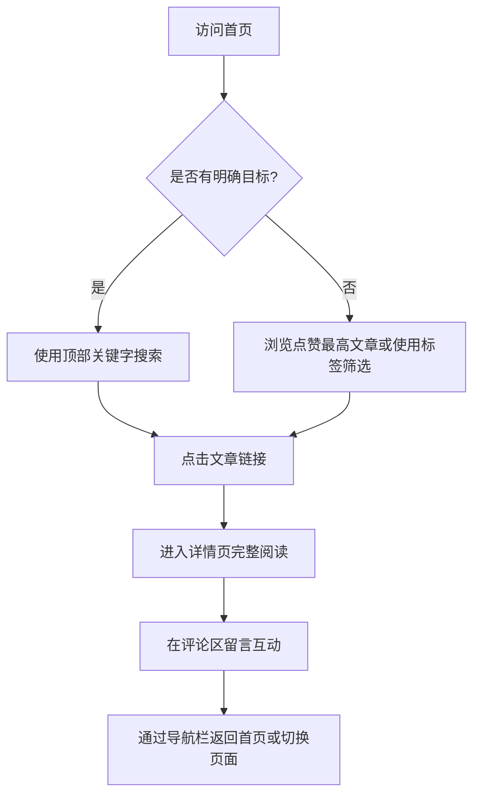

## 1. 产品概述
本项目是一个具有“科技感”设计风格的个人博客网站。
- 主要用于展示个人技术文章，提供便捷的检索和互动功能，目标受众为技术爱好者和开发者。
- 通过极具现代科技感的视觉设计，提升阅读体验和个人技术品牌的专业度。

## 2. 核心功能

### 2.1 用户角色
| 角色 | 注册方式 | 核心权限 |
|------|---------------------|------------------|
| 访客/普通用户 | 无需注册（或匿名/本地存储） | 浏览文章、使用搜索与标签筛选、发表评论 |
| 博主（管理员） | 预设账号（概念上） | 管理文章和评论（本期暂定前端展示为主） |

### 2.2 功能模块
1. **全局导航栏**：简洁的导航栏，包含Logo/首页链接、搜索框等，支持页面间的流畅切换。
2. **首页 (Home Page)**：置顶展示点赞量最高的文章标题与摘要、标签筛选区、文章列表展示区。
3. **文章详情页 (Details Page)**：完整的文章内容展示、评论互动区。

### 2.3 页面详情
| 页面名称 | 模块名称 | 功能描述 |
|-----------|-------------|---------------------|
| 首页 | 热门文章推荐 | 动态展示点赞量最高的文章的标题和摘要。 |
| 首页 | 顶部搜索栏 | 允许用户输入关键字对文章进行全文或标题检索。 |
| 首页 | 标签筛选器 | 提供多个标签选项，用户点击后过滤显示相关文章。 |
| 首页 | 文章列表 | 以科技感卡片形式列出文章，点击标题或链接跳转至详情页。 |
| 详情页 | 文章阅读区 | 使用清晰的排版完整展示文章内容，支持代码高亮等技术阅读需求。 |
| 详情页 | 评论互动区 | 用户可在页面下方留言评论，显示历史评论列表。 |
| 全局 | 导航栏 | 悬浮或固定的简洁导航，方便用户随时返回首页或使用搜索。 |

## 3. 核心流程
用户进入博客后，可以直接在首页看到最热门的文章，或通过顶部搜索栏和标签筛选感兴趣的内容。点击文章后进入详情页阅读，并在底部进行评论留言。

## 4. 用户界面设计
### 4.1 设计风格
- **主副色调**：深色模式为主（如深灰/黑背景），辅以霓虹蓝（Neon Blue）或荧光绿（Cyber Green）作为强调色，营造赛博朋克或极客科技感。
- **按钮与交互风格**：发光边框效果（Glow effect）、玻璃拟物化（Glassmorphism）的半透明卡片、悬停时的平滑过渡与科技感发光动画。
- **字体与大小**：标题使用具有几何感和现代感的无衬线字体（如 Rajdhani, Space Grotesk 或 Orbitron），正文使用易读的无衬线字体（如 Inter, Roboto）。
- **布局风格**：网格化（Grid）布局，模块之间有清晰的几何分割线，卡片式文章列表。
- **图标风格**：使用细线风格的极简图标（Line icons）。

### 4.2 页面设计概览
| 页面名称 | 模块名称 | UI 元素与设计 |
|-----------|-------------|-------------|
| 首页 | 导航栏 | 玻璃拟物化背景，固定在顶部，包含发光Logo和极简搜索框。 |
| 首页 | 热门文章区 | 大尺寸卡片，带有微弱的发光边框，突出显示标题和摘要，背景可带有微妙的网格纹理。 |
| 首页 | 标签与列表 | 标签为胶囊状，选中时呈现霓虹色填充；列表为科技感网格卡片，悬浮时边框高亮。 |
| 详情页 | 文章内容 | 宽幅居中排版，代码块带有深色主题和语法高亮，段落间距舒适。 |
| 详情页 | 评论区 | 极简的输入框（带有底部发光线），留言列表具有清晰的层级感。 |

### 4.3 响应式设计
- **桌面端优先**：充分利用宽屏展示科技感的网格和悬浮效果。
- **移动端适配**：导航栏折叠为汉堡菜单，文章列表转为单列，优化卡片在触摸屏上的点击区域和发光反馈。