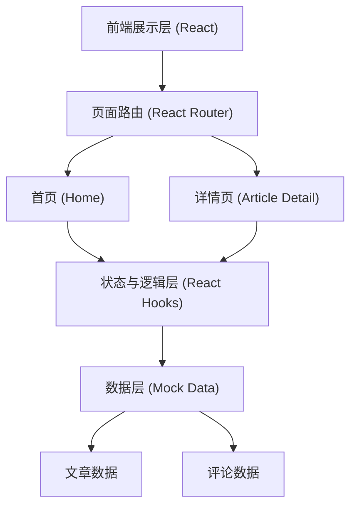

## 1. 架构设计
本项目为纯前端单页应用（SPA），数据层通过本地 Mock 数据实现，无需真实后端。



## 2. 技术说明
- **前端框架**：React@18 (通过 Vite 构建，提供极速的开发体验)
- **样式方案**：Tailwind CSS@3 (通过配置自定义的主题颜色、发光特效和玻璃态类名，快速实现科技感 UI)
- **路由管理**：React Router v6 (实现首页和详情页的无缝切换)
- **图标库**：Lucide React (提供简洁现代的 SVG 图标，如搜索、评论、返回等)
- **动画与交互**：Framer Motion (用于实现页面切换动画、卡片悬浮动效和霓虹发光过渡)
- **数据管理**：使用 React `useState` 和 `useEffect` 结合本地 Mock 数据管理文章列表和评论状态。

## 3. 路由定义
| 路由路径 | 页面用途 | 对应组件 |
|----------|----------|----------|
| `/` | 博客首页（包含搜索、标签筛选、最热文章、文章列表） | `Home.jsx` |
| `/post/:id` | 文章详情页（展示完整文章内容、评论区） | `PostDetail.jsx` |

## 4. 数据模型 (Mock)

### 4.1 数据结构定义

为了在前端模拟真实的交互，我们需要定义以下 TypeScript/结构接口（实际在 JS 中作为 Mock 数据的结构）：

```typescript
// 文章接口
interface Article {
  id: string;          // 文章唯一标识
  title: string;       // 文章标题
  summary: string;     // 文章摘要
  content: string;     // 文章正文内容 (支持 Markdown 或 HTML 格式的字符串)
  tags: string[];      // 标签数组 (如: ['React', '前端', 'AI'])
  likes: number;       // 点赞量 (用于筛选最热文章)
  createdAt: string;   // 发布日期
}

// 评论接口
interface Comment {
  id: string;          // 评论唯一标识
  articleId: string;   // 关联的文章 ID
  author: string;      // 评论者昵称
  content: string;     // 评论内容
  createdAt: string;   // 评论时间
}
```

### 4.2 状态管理逻辑
- **首页**：维护 `searchQuery`（搜索关键字）和 `selectedTag`（选中的标签）状态。基于这两个状态对全量 Mock 文章数据进行过滤。
- **最热文章计算**：通过对全量文章数组按 `likes` 字段降序排序，取第一项作为最热文章在首页顶部展示。
- **详情页评论**：维护一个基于 `articleId` 过滤的评论数组状态。用户提交新评论时，向该数组 `push` 新对象并更新状态，模拟真实留言功能。