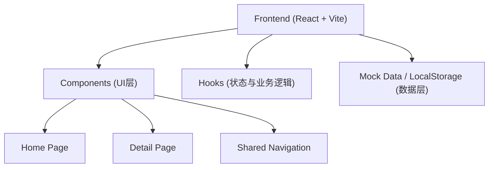
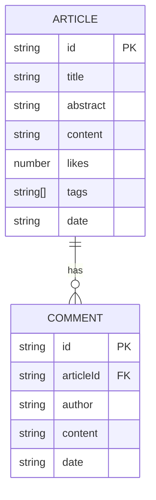

## 1. 架构设计
本项目采用现代前端技术栈进行构建，为实现纯前端演示，数据将采用 Mock 数据，评论功能通过 LocalStorage 模拟持久化。


## 2. 技术说明
- **前端框架**: React@18 (函数式组件 + Hooks)
- **构建工具**: Vite
- **路由管理**: React Router v6
- **样式方案**: Tailwind CSS v3 (用于快速构建科技感UI，如深色模式、发光效果、网格布局)
- **图标库**: Lucide React (提供细线风格图标)
- **图标与特效**: Framer Motion (可选，用于实现科技感平滑过渡与页面切换动画)

## 3. 路由定义
| 路由 | 用途 |
|-------|---------|
| `/` | 首页：展示热门文章、搜索框、标签筛选和文章列表 |
| `/article/:id` | 详情页：根据ID展示完整文章内容及评论互动区 |

## 4. 数据模型 (Mock Data)
### 4.1 数据模型定义


### 4.2 数据结构示例 (TypeScript 接口)
```typescript
interface Article {
  id: string;
  title: string;
  abstract: string;
  content: string;
  likes: number;
  tags: string[];
  date: string;
}

interface Comment {
  id: string;
  articleId: string;
  author: string;
  content: string;
  date: string;
}
```
*注：由于是前端项目，上述数据结构将作为初始状态存储在内存或 LocalStorage 中，并通过自定义 Hooks（如 `useArticles`, `useComments`）进行读取和更新。*