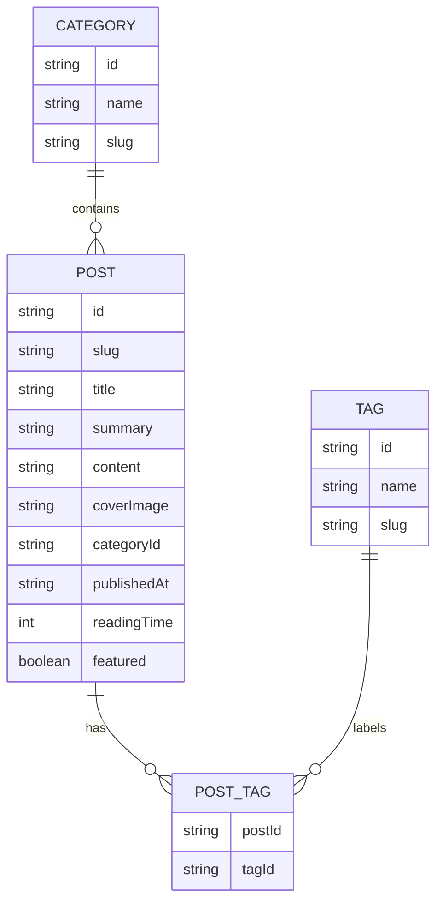

## 1. Architecture Design

## 2. Technology Description
- Frontend: React@18 + Tailwind CSS@3 + Vite  
- Initialization Tool: vite-init  
- Backend: None（纯前端静态博客展示）  
- Database: None（使用本地 mock 数据文件组织文章内容）

## 3. Route Definitions
| Route | Purpose |
|-------|---------|
| / | 博客首页，展示品牌信息、推荐文章与最新文章 |
| /post/:slug | 文章详情页，展示正文、目录与相关推荐 |
| /archive | 归档与分类页，按时间与分类浏览文章 |

## 4. Data Model
### 4.1 Data Model Definition

### 4.2 Data Definition
- 使用 `src/data/posts.ts` 管理文章数组，字段包含 slug、title、summary、content、categoryId、publishedAt、featured  
- 使用 `src/data/categories.ts` 管理分类信息并提供分类统计  
- 使用 `src/lib/content.ts` 提供文章查询、相关推荐、归档分组等纯函数  
- 使用 `src/types/content.ts` 定义 `Post`、`Category`、`Tag` 与查询结果类型，保证页面渲染类型安全
