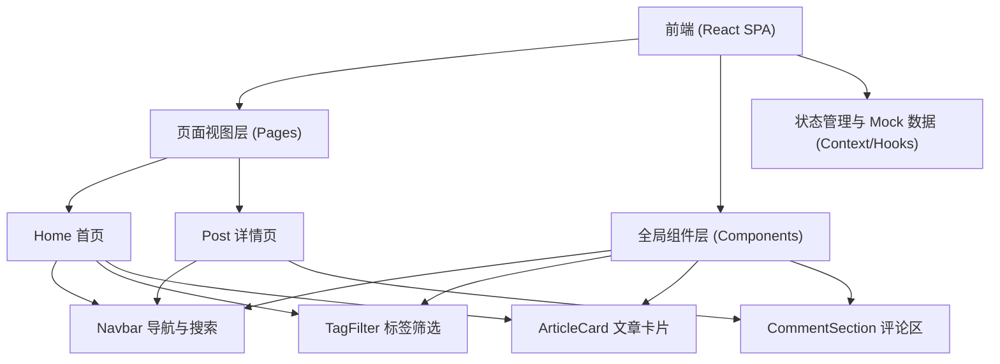

## 1. 架构设计
基于现代化前端技术栈实现的无后端（Mock数据）单页面应用架构。系统采用组件化设计，实现数据流与视图渲染的分离，并通过前端路由实现无缝跳转。



## 2. 技术栈说明
- **框架与构建工具**：React@18 + Vite
- **UI与样式**：Tailwind CSS v3 (用于快速构建科技感深色主题、发光效果及响应式布局)
- **路由管理**：react-router-dom@6 (提供简洁导航和流畅切换体验)
- **动画与交互**：framer-motion (实现页面过渡动效、悬浮发光和科技感微动效)
- **图标库**：lucide-react (提供简洁的几何图标)
- **内容渲染**：react-markdown (用于渲染详情页中的 Markdown 格式文章)
- **代码高亮**：react-syntax-highlighter (为代码块提供科技感的主题高亮)

## 3. 路由定义
| 路由路径 | 组件/页面名称 | 页面描述 |
|-------|---------|---------|
| `/` | `HomePage` | 首页展示，包含导航搜索框、标签栏、热门文章列表 |
| `/post/:id` | `PostPage` | 文章详情页，展示完整文章内容、代码高亮和底部评论互动区 |

## 4. 核心数据结构 (Mock 数据模型)

### 4.1 Article 模型
用于展示首页列表和详情页核心内容。
```typescript
interface Article {
  id: string;
  title: string;
  summary: string;
  content: string; // Markdown 文本
  tags: string[];
  likes: number;
  date: string;
  coverImage?: string; // 可选的科技感封面配图
}
```

### 4.2 Comment 模型
用于详情页的留言评论互动功能。
```typescript
interface Comment {
  id: string;
  articleId: string;
  author: string;
  avatar: string; // 默认科技感头像
  content: string;
  date: string;
}
```

## 5. 组件与状态流转设计
- **全局状态 (Context/State)**:
  - `articles`: 维护所有文章数据的数组，供搜索和筛选。
  - `searchQuery`: 当前搜索的关键字，控制首页文章列表过滤。
  - `activeTag`: 当前选中的标签，用于辅助过滤。
- **页面间传参**:
  - 首页点击文章卡片时，通过 React Router 的 `Link` 跳转至 `/post/:id`，详情页根据路由参数 `id` 从 `articles` 中查询对应的文章数据并渲染。
- **评论互动机制**:
  - `PostPage` 中维护局部的 `comments` 状态数组，用户在底部提交评论时，向该数组添加新评论对象，实现即时的页面更新反馈。
