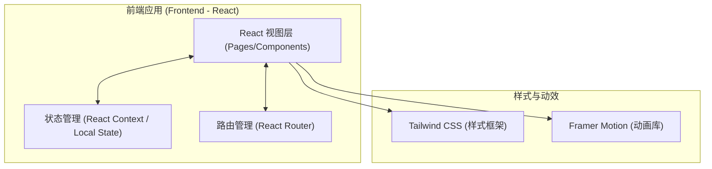
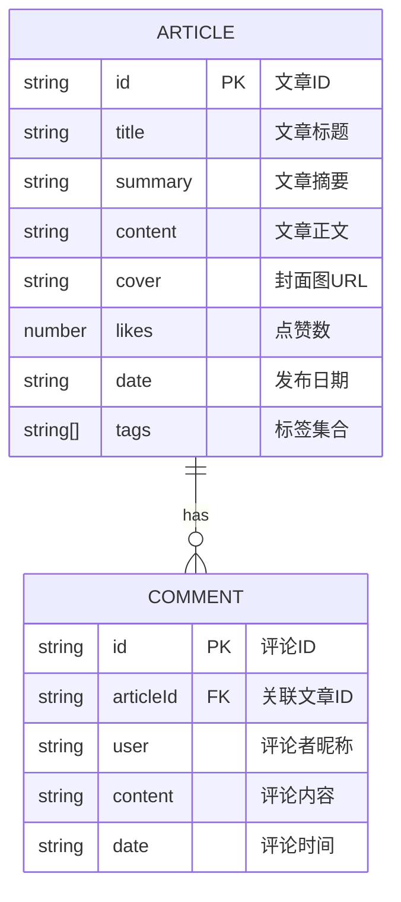

## 1. 架构设计

本项目为纯前端实现（Mock Data），无需真实后端服务即可展示完整交互逻辑。

## 2. 技术说明
- **前端框架**: React@18
- **构建工具**: Vite
- **样式方案**: Tailwind CSS@3 + Lucide React (图标)
- **动画方案**: Framer Motion (实现科技感过渡动效)
- **路由方案**: React Router v6

## 3. 路由定义
| 路由 | 用途 |
|------|------|
| `/` | 博客首页，包含高赞文章、搜索、标签筛选及文章列表 |
| `/article/:id` | 文章详情页，展示完整内容及评论互动区 |

## 4. API 定义 (Mock 数据接口)
本项目由于没有真实后端，将在前端通过 Mock 数据和 LocalStorage 模拟以下接口：
- `getArticles(keyword, tag)`: 获取文章列表（支持搜索和标签过滤）
- `getTopLikedArticle()`: 获取点赞量最高的文章
- `getArticleById(id)`: 获取单篇文章详情
- `getCommentsByArticleId(id)`: 获取文章的评论列表
- `postComment(articleId, user, content)`: 提交新评论（保存到 LocalStorage）

## 5. 数据模型设计 (前端状态)
### 5.1 数据模型定义

