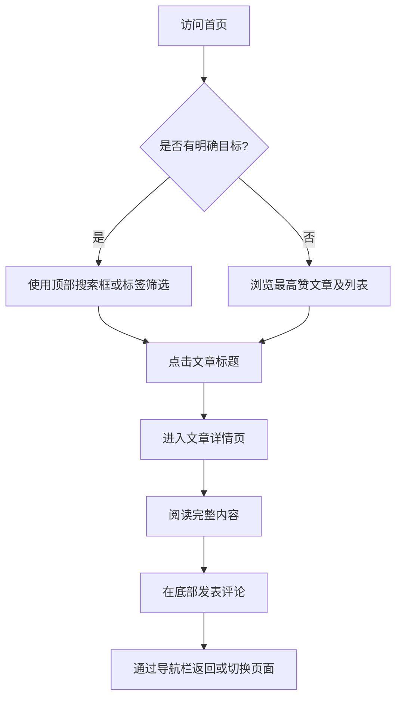

## 1. 产品概述
具有科技感的个人博客网站
- 本项目旨在为用户提供一个具有强烈科技感、未来感的个人博客平台，方便浏览高质量技术文章。
- 提供文章检索、标签筛选、详情阅读及评论互动功能，打造沉浸式的极客阅读体验。

## 2. 核心功能

### 2.1 功能模块
1. **首页 (Home Page)**：顶部导航栏（包含搜索框）、标签筛选区、最高赞文章展示区、文章列表。
2. **详情页 (Details Page)**：顶部导航栏、文章完整内容展示、评论互动区。

### 2.2 页面详细说明
| 页面名称 | 模块名称 | 功能描述 |
|-----------|-------------|---------------------|
| 首页 | 顶部导航栏 | 包含Logo、全局导航链接以及关键字搜索框。 |
| 首页 | 标签筛选区 | 展示各类技术标签（如前端、后端、AI等），点击可过滤文章。 |
| 首页 | 最高赞文章区 | 以视觉冲击力强的卡片形式，展示点赞量最高的文章标题和摘要。 |
| 首页 | 文章列表 | 展示所有文章或筛选后的文章简述，点击标题或链接跳转到详情页。 |
| 详情页 | 导航栏 | 简洁的导航栏，支持返回首页或在网站页面间流畅切换。 |
| 详情页 | 文章内容 | 完整展示文章的标题、作者、发布时间、正文内容（支持Markdown排版风格）。 |
| 详情页 | 评论区 | 允许用户在文章底部浏览历史评论，并发布新留言进行互动。 |

## 3. 核心流程
用户进入博客网站后，可以通过搜索或标签筛选找到感兴趣的文章，点击阅读并在详情页进行评论。

## 4. 用户界面设计
### 4.1 设计风格
- **主色调与配色**：深邃黑/深空灰（如 `#0F172A`）为背景底色，搭配赛博朋克风格的霓虹蓝（`#00F0FF`）和荧光紫（`#8A2BE2`）作为点缀色。
- **按钮与交互样式**：带有发光边框（Glow effect）、悬浮时有微小放大及颜色渐变效果，无边框或极细边框的扁平化科技感按钮。
- **字体**：标题使用带有几何感的无衬线字体（如 `Space Grotesk` 或 `Inter`），代码或数据部分使用等宽字体（如 `Fira Code` 或 `JetBrains Mono`）。
- **布局风格**：网格系统（Grid），卡片式布局，背景可带有微妙的网格线或点阵纹理，毛玻璃效果（Glassmorphism）用于导航栏和浮动组件。
- **图标/装饰**：极简线形图标，带有科技感的装饰线条和发光点。

### 4.2 页面设计概览
| 页面名称 | 模块名称 | UI 元素及设计 |
|-----------|-------------|-------------|
| 首页 | 顶部导航栏 | 悬浮毛玻璃背景，右侧发光搜索框，左侧科技感Logo。 |
| 首页 | 推荐文章卡片 | 带有霓虹边框发光效果的大卡片，突出标题和数据（点赞数）。 |
| 首页 | 标签筛选区 | 胶囊状按钮，选中时填充荧光色并带有外发光。 |
| 详情页 | 文章正文 | 深色阅读背景，高对比度文字，代码块带有终端风格样式。 |
| 详情页 | 评论区 | 极简输入框，聚焦时边框发光，评论列表以时间轴或对话框形式展现。 |

### 4.3 响应式设计
优先桌面端设计（宽屏带来更强的科技沉浸感），自适应移动端，触摸操作优化，移动端搜索框和导航可折叠为汉堡菜单。