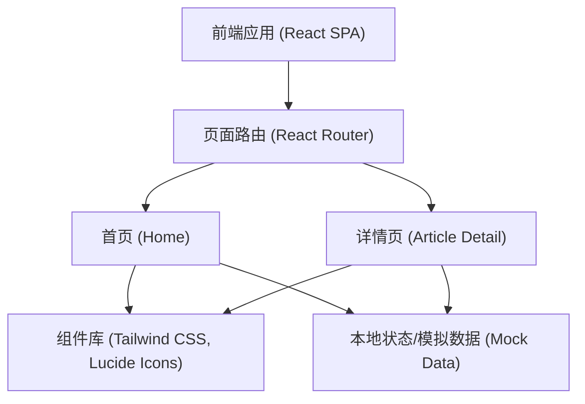

## 1. 架构设计



## 2. 技术说明
- **前端**: React@18 + tailwindcss@3 + vite
- **样式方案**: Tailwind CSS (用于快速实现复杂的科技感样式、发光效果、毛玻璃等)
- **路由管理**: React Router v6
- **图标库**: Lucide React
- **状态与数据**: 使用本地 Mock 数据（如文章列表、评论数据），通过 React Context 或 useState 进行简单状态管理。

## 3. 路由定义
| 路由路径 | 用途 |
|-------|---------|
| `/` | 首页，包含搜索、标签筛选、文章列表及最高赞文章展示 |
| `/article/:id` | 文章详情页，展示指定 ID 的文章完整内容及评论区 |

## 4. API 定义
由于是纯前端实现（Mock数据），此处定义前端内部使用的数据结构接口：

```typescript
// 文章接口
export interface Article {
  id: string;
  title: string;
  summary: string;
  content: string;
  author: string;
  date: string;
  likes: number;
  tags: string[];
}

// 评论接口
export interface Comment {
  id: string;
  articleId: string;
  author: string;
  content: string;
  date: string;
}
```

## 5. 数据模型
无后端数据库，采用本地静态数据进行模拟。