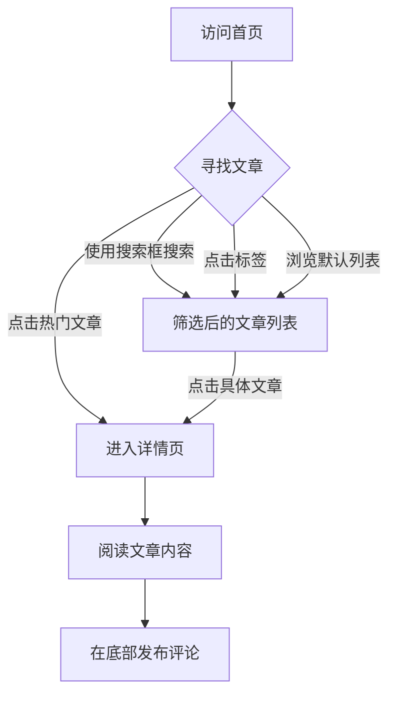

## 1. 产品概述
个人博客网站，采用极具科技感（Cyber/Sci-Fi）的设计风格。
- 主要用于展示个人技术文章，提供便捷的搜索与标签筛选功能。
- 面向对技术感兴趣的读者，打造沉浸式、未来感的阅读体验。

## 2. 核心功能

### 2.1 用户角色
| 角色 | 注册方式 | 核心权限 |
|------|---------------------|------------------|
| 访客 | 无需注册 | 浏览文章、搜索、标签筛选、发布评论 |

### 2.2 功能模块
1. **首页**：导航与搜索、热门推荐（最高点赞）、标签筛选、文章列表。
2. **详情页**：简洁导航栏、完整文章正文、用户评论互动。

### 2.3 页面详细信息
| 页面名称 | 模块名称 | 功能描述 |
|-----------|-------------|---------------------|
| 首页 | 导航与搜索 | 顶部提供全局导航和基于关键字的全局搜索框 |
| 首页 | 热门推荐 | 突出展示点赞量最高的文章的标题和摘要 |
| 首页 | 标签筛选 | 提供一组标签（如前端、AI、后端等），点击可过滤文章列表 |
| 首页 | 文章列表 | 展示文章标题、摘要、发布时间、点赞数，点击可跳转至详情页 |
| 详情页 | 导航栏 | 简洁导航栏，提供返回首页的快速通道，支持在不同页面间流畅切换 |
| 详情页 | 文章正文 | 完整渲染展示文章详情内容（标题、时间、正文段落） |
| 详情页 | 评论互动 | 用户可在底部输入框提交留言并展示留言列表 |

## 3. 核心流程
访客进入网站后，可浏览推荐文章或使用搜索、标签寻找感兴趣的文章，点击进入详情页阅读，并可在底部发表评论。

## 4. 用户界面设计
### 4.1 设计风格
- **主副颜色**：深邃的背景（如深渊黑 `#050505`、暗蓝 `#0a0f18`），配合霓虹强调色（如赛博青 `#00f0ff`，霓虹紫 `#bc13fe`）。
- **按钮样式**：带发光边框或细线科技感边框的悬浮按钮，Hover时带有霓虹扫光特效，棱角分明。
- **字体与大小**：标题使用等宽字体（Monospace）以突出代码与科技氛围；正文使用无衬线字体保证阅读体验。
- **布局风格**：网格化（Grid）布局，模块之间有半透明的发光边框隔离，极具信息层级。
- **图标风格**：极简的线性图标，结合霓虹发光效果。

### 4.2 页面设计概览
| 页面名称 | 模块名称 | UI元素 |
|-----------|-------------|-------------|
| 首页 | 全局导航 | 顶部固定或毛玻璃效果，包含Logo和搜索框（光标闪烁特效）。 |
| 首页 | 热门文章 | 大卡片展示，背景带微弱渐变光晕或网格纹理，突出标题和摘要。 |
| 首页 | 标签与列表 | 标签为科技感胶囊按钮；列表项为玻璃拟态暗色卡片，Hover时边框发光。 |
| 详情页 | 文章正文 | 宽排版，文字高对比度，段落间距宽松。 |
| 详情页 | 留言区 | 输入框带科技感边框焦点特效，留言列表具有终端日志般的展示风格。 |

### 4.3 响应式
- 桌面端优先，大屏下充分利用网格布局展示多列卡片和侧边栏。
- 移动端自适应，搜索框可响应式缩放，标签横向滑动，列表变为单列。
