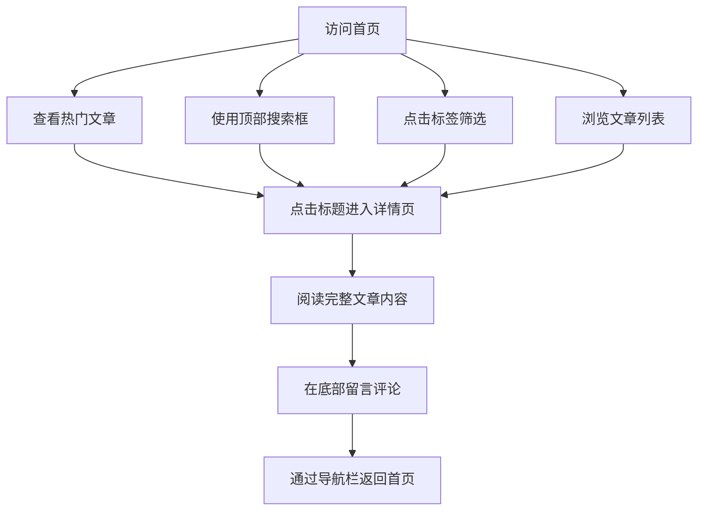

# 个人博客网站产品需求文档 (PRD)

## 1. 产品概述
本项目旨在打造一个具有“科技感”设计的个人博客网站。
核心目标是提供一个现代、极客风格的阅读和互动体验，主要针对技术分享、编程心得和前沿科技探索，面向技术爱好者和开发者群体。

## 2. 核心功能

### 2.1 用户角色
| 角色 | 注册方式 | 核心权限 |
|------|----------|----------|
| 访客 | 无需注册 | 浏览文章、使用搜索与标签筛选、查看和发布评论 |
| 博主 | 系统预设 | 拥有所有文章的管理和发布权限（本期暂不涉及后台开发，以静态数据演示为主） |

### 2.2 功能模块
1. **首页 (Home Page)**：顶部导航与搜索、热门文章展示、标签筛选区、文章列表。
2. **详情页 (Details Page)**：导航栏、文章完整内容展示、评论互动区。

### 2.3 页面详情
| 页面名称 | 模块名称 | 功能描述 |
|----------|----------|----------|
| 首页 | 顶部导航栏 | 包含网站Logo和全局关键字搜索框。 |
| 首页 | 热门文章区 | 醒目展示点赞量最高的文章的标题和摘要。 |
| 首页 | 标签筛选区 | 允许用户点击不同的技术标签（如 React, AI, Node.js 等）筛选文章列表。 |
| 首页 | 文章列表区 | 展示博客文章，点击文章标题或链接跳转至详情页。 |
| 详情页 | 顶部导航栏 | 提供返回首页或切换其他栏目的简洁导航，确保流畅切换。 |
| 详情页 | 文章内容区 | 完整展示文章的图文内容，排版需体现技术博客特色。 |
| 详情页 | 评论互动区 | 用户可在底部输入框留言评论，并展示历史评论列表。 |

## 3. 核心流程

## 4. 用户界面设计

### 4.1 设计风格 (科技感)
- **主色调与辅助色**：采用深色模式（Dark Mode），背景色为深邃黑（如 `#0A0A0F`），点缀赛博朋克风格的霓虹蓝（Cyan `#00F0FF`）和极客紫（Purple `#8A2BE2`）。
- **按钮与控件风格**：采用玻璃拟态（Glassmorphism）、微发光边框（Glow Effect）、锐利直角设计，体现工业与未来感。
- **字体与大小**：标题使用极具现代感和几何特征的无衬线字体（如 `Space Grotesk` 或等宽字体），正文保证清晰易读。
- **布局风格**：网格化（Grid）布局，悬浮卡片式设计，强调空间感。
- **动效**：鼠标悬停（Hover）时有平滑的发光过渡，页面元素有淡入淡出的科幻感入场效果。

### 4.2 页面设计概览
| 页面名称 | 模块名称 | UI元素设计 |
|----------|----------|------------|
| 首页 | 顶部搜索框 | 带有发光边框的半透明输入框，聚焦时边框变亮并产生光晕。 |
| 首页 | 热门文章 | 大面积卡片，背景带有微妙的网格纹理，突出标题和摘要。 |
| 首页 | 标签列表 | 控制台标签的样式，选中状态有霓虹发光效果。 |
| 详情页 | 导航栏 | 简洁的毛玻璃效果吸顶导航。 |
| 详情页 | 评论区 | 极简输入框搭配赛博风格的“发送”按钮，评论列表以极客终端形式呈现。 |

### 4.3 响应式设计
采用 Desktop-first（桌面端优先）设计，完美适配移动端。移动端下搜索框和标签折叠或横向滚动，保证触控体验。