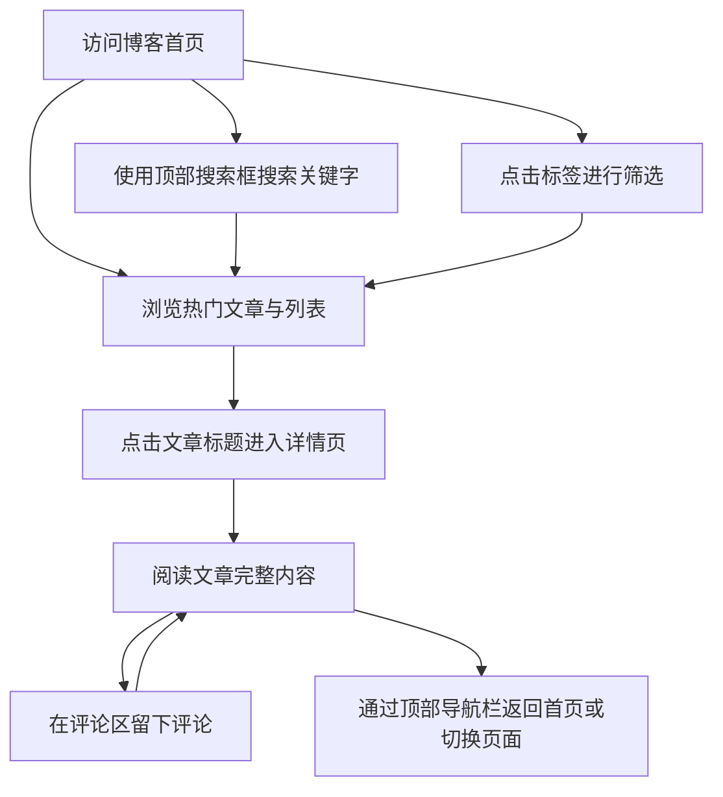

# 个人博客网站产品需求文档 (PRD)

## 1. 产品概述
本项目旨在设计并开发一个具有强烈“科技感”美学的个人博客网站。
该博客不仅作为作者展示技术文章、分享见解的平台，还通过赛博朋克/未来主义的视觉风格，为访问者提供沉浸式的阅读与互动体验。

## 2. 核心功能

### 2.1 用户角色
| 角色 | 注册方式 | 核心权限 |
|------|----------|----------|
| 访客 | 无需注册 | 浏览首页、搜索文章、按标签筛选、阅读文章详情、发表留言评论 |
| 作者 | 预设账号 | (本期主要实现前端展示，后台管理暂由本地数据模拟) |

### 2.2 功能模块
1. **首页 (Home Page)**: 包含顶部导航与搜索、热门文章推荐、文章列表（支持标签筛选）。
2. **详情页 (Details Page)**: 包含文章完整内容展示、底部留言评论区。

### 2.3 页面详情
| 页面名称 | 模块名称 | 功能描述 |
|----------|----------|----------|
| 首页 | 顶部导航栏 | 包含 Logo、搜索框（关键字搜索）、以及页面间切换的导航链接。 |
| 首页 | 热门文章推荐 | 醒目展示点赞量最高（或精选）的文章标题和摘要，吸引点击。 |
| 首页 | 标签筛选区 | 列出所有可用标签，点击标签可对下方的文章列表进行筛选显示。 |
| 首页 | 文章列表区 | 展示各篇文章的标题、摘要、标签等信息，点击标题或卡片可跳转至详情页。 |
| 详情页 | 文章内容区 | 完整排版展示文章正文，支持 Markdown 样式的代码块和科技感排版。 |
| 详情页 | 互动评论区 | 允许用户在页面下方输入昵称和内容进行留言评论，实现互动功能。 |

## 3. 核心流程
用户在博客网站中的主要交互流程如下：

## 4. 用户界面设计

### 4.1 设计风格 (科技感)
- **主色调与辅助色**: 以深空黑（#0A0A0A）或深灰蓝为主背景色，搭配霓虹蓝（#00F0FF）、荧光绿（#00FF66）或赛博紫（#B026FF）作为强调色和发光效果。
- **按钮与交互样式**: 采用带有发光边框（Neon Glow）、毛玻璃效果（Glassmorphism）或略带工业风切割角的按钮设计。悬停时有明显的颜色渐变或光晕扩展。
- **字体与排版**: 标题使用具有未来感、硬朗几何特征的无衬线字体（如 Rajdhani, Orbitron 或 Roboto Mono）；正文使用高可读性的无衬线字体（如 Inter, Noto Sans）。
- **布局风格**: 卡片式布局，卡片背景采用半透明暗色，边框细腻且带有微光；顶部固定导航栏以保证切换的流畅性。
- **视觉细节**: 页面背景可增加微妙的网格线（Grid）、粒子动画或代码雨暗纹，以增强“科技”氛围。

### 4.2 页面设计概览
| 页面名称 | 模块名称 | UI 元素与风格 |
|----------|----------|---------------|
| 首页 | 导航与搜索 | 毛玻璃质感顶部吸顶栏，搜索框带有发光聚焦状态和科技感图标。 |
| 首页 | 热门推荐 | 大尺寸横幅或卡片，具有强烈的发光边框，悬停有放大与流光效果。 |
| 首页 | 文章列表 | 错落有致的网格或列表布局，标签采用霓虹色胶囊样式。 |
| 详情页 | 内容排版 | 高对比度阅读区，代码块采用深色主题及荧光语法高亮。 |
| 详情页 | 评论区 | 极简未来风的输入框，评论列表采用时间线或科技感卡片形式呈现。 |

### 4.3 响应式设计
采用 Desktop-first（桌面端优先）策略，确保在大屏幕上有震撼的视觉展开；同时进行移动端适配（Mobile-adaptive），在小屏幕上将网格折叠为单列，调整字体大小并优化触控交互。
