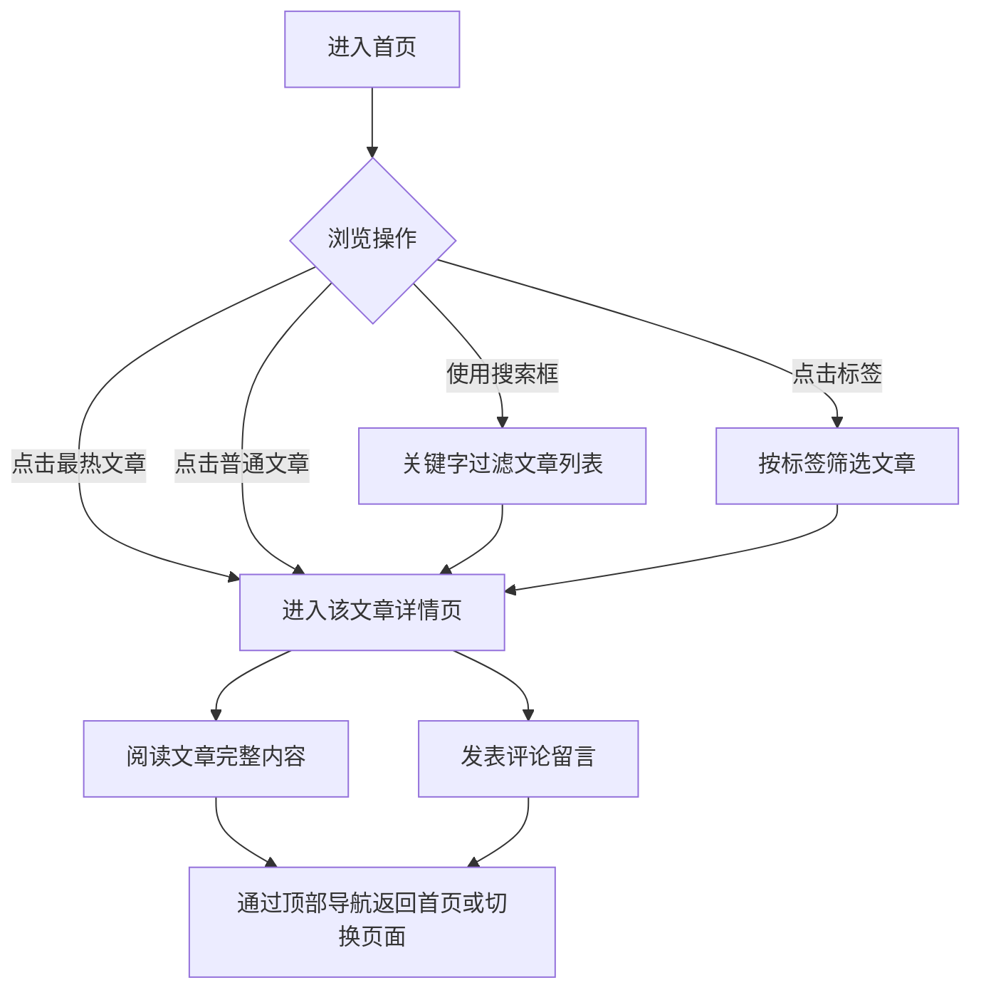

## 1. 产品概述
设计并创建一个具有科技感的个人博客网站，作为个人技术文章和思想的展示平台。
- 核心功能：首页展示点赞量最高的文章、支持关键字搜索和标签筛选；详情页完整展示文章内容，并提供评论互动功能；全局提供简洁流畅的导航栏。
- 目标：提供极具现代感和未来感的视觉体验，强调“科技感”设计（深色主题、发光元素、玻璃拟态等），吸引技术爱好者的关注。

## 2. 核心功能

### 2.1 功能模块
1. **首页**: 包含顶部导航、搜索框、热门文章推荐区、标签筛选区以及文章列表。
2. **详情页**: 包含全局导航、文章详情阅读区、用户评论互动区。

### 2.2 页面详细说明
| 页面名称 | 模块名称 | 功能描述 |
|-----------|-------------|---------------------|
| 首页 | 导航与搜索 | 顶部提供全局导航栏，内嵌搜索框，支持对文章的关键字搜索 |
| 首页 | 热门推荐 | 醒目展示点赞量最高的文章的标题和摘要，吸引用户点击 |
| 首页 | 标签筛选 | 展示系统中的所有标签，允许用户点击标签对文章列表进行过滤 |
| 首页 | 文章列表 | 分页或滚动加载文章卡片，点击文章标题或链接跳转到详情页 |
| 详情页 | 文章阅读 | 在详情页完整展示文章内容，排版清晰且具备代码高亮等科技感元素 |
| 详情页 | 评论互动 | 用户可以在文章底部留言评论，查看他人的评论，实现互动功能 |
| 详情页 | 全局导航 | 页面顶部保持简洁的导航栏，方便用户在网站页面之间进行流畅切换 |

## 3. 核心流程
用户通过访问博客主干道进行文章阅读和互动。

## 4. 用户界面设计
### 4.1 设计风格
- **主色调**：深邃的背景色（如 `#0F172A` 或更深邃的黑），辅以具有科技感的发光点缀色（如霓虹蓝 `#38BDF8`、赛博紫 `#C084FC` 或荧光绿）。
- **材质与质感**：广泛使用玻璃拟态（Glassmorphism），半透明背景叠加模糊效果，辅以极细的发光边框。
- **排版字体**：使用现代化的无衬线字体或等宽编程字体（如 Inter, JetBrains Mono 等），确保文字清晰易读。
- **动效**：卡片悬浮时触发柔和的发光阴影（Glow Hover Effect），页面切换和元素出现时的平滑淡入动效，营造未来感。

### 4.2 页面设计概览
| 页面名称 | 模块名称 | UI元素设计 |
|-----------|-------------|-------------|
| 全局 | 导航栏 | 悬浮固定在顶部的毛玻璃条，包含Logo/标题和右侧搜索输入框（发光边框） |
| 首页 | 热门推荐 | 大尺寸醒目卡片，背景带有动态渐变或科技感纹理，高亮显示标题、摘要及点赞数 |
| 首页 | 标签区 | 药丸状（Pill）发光按钮，选中时高亮或边框发光 |
| 首页 | 文章列表 | 简洁的深色卡片列表，悬浮时边框或阴影颜色发生变化 |
| 详情页 | 文章内容 | 宽幅中心排版，高对比度正文，大标题使用渐变文字，代码块使用类似终端的深色主题 |
| 详情页 | 评论区 | 极简的输入框（获得焦点时发光），带有霓虹效果的提交按钮，列表呈现用户留言 |

### 4.3 响应式设计
- 桌面端优先：充分利用屏幕宽度展现卡片网格和悬浮特效。
- 移动端适配：导航栏收起为简洁菜单，热门推荐和列表改为单列布局，调整字体和触摸目标大小。
