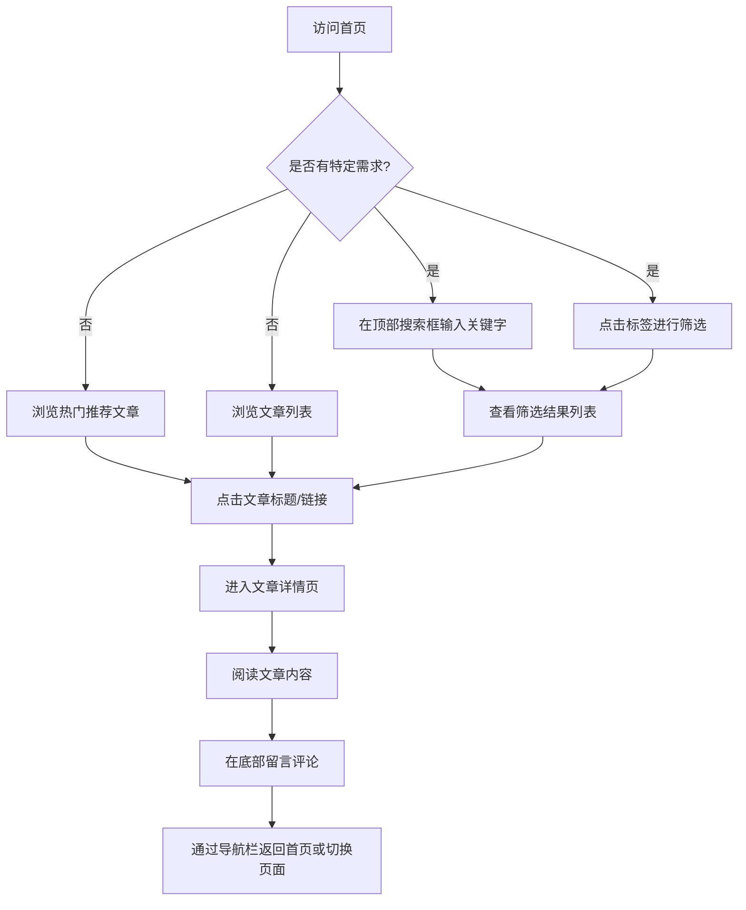

## 1. 产品概述
本项目是一个具有强烈“科技感”（Tech-style / Cyberpunk）设计的个人博客网站。
- 主要目的是为博主提供一个展示技术文章、分享见解的平台，同时给访客带来沉浸式的未来主义视觉体验。
- 目标用户为对技术感兴趣的开发者、极客及设计师，通过高度定制化的UI和流畅的交互提升阅读体验和互动意愿。

## 2. 核心功能

### 2.1 用户角色
| 角色 | 注册方式 | 核心权限 |
|------|---------------------|------------------|
| 访客 | 无需注册 | 浏览文章、使用搜索和标签筛选、查看文章详情、发表留言评论 |

### 2.2 功能模块
1. **首页**: 顶部导航（含搜索框）、热门推荐（点赞量最高文章）、标签筛选区、文章列表。
2. **详情页**: 简洁导航栏、文章完整内容展示、评论互动区。

### 2.3 页面详情
| 页面名称 | 模块名称 | 功能描述 |
|-----------|-------------|---------------------|
| 首页 | 顶部导航栏 | 提供网站Logo及全局关键字搜索框，方便快速查找文章。 |
| 首页 | 热门推荐 | 醒目展示点赞量最高的文章，包括标题、摘要及封面图。 |
| 首页 | 标签筛选 | 列出文章标签（如前端、AI、后端等），点击标签过滤下方的文章列表。 |
| 首页 | 文章列表 | 展示文章的标题、摘要、标签等信息，点击标题或链接可跳转至详情页。 |
| 详情页 | 简洁导航栏 | 方便用户在网站页面之间进行流畅切换，快速返回首页。 |
| 详情页 | 文章内容 | 完整展示文章正文排版，支持代码块高亮及科技感排版。 |
| 详情页 | 评论互动区 | 用户可在页面底部留言评论，查看其他访客的评论，实现互动功能。 |

## 3. 核心流程
用户访问网站的核心交互流程如下：

## 4. 用户界面设计
### 4.1 设计风格
- **整体风格**：科技感、未来主义（Futuristic）、赛博朋克（Cyberpunk）微调版。
- **色彩规范**：
  - 背景色：深邃太空黑（如 `#090A0F`）或深网格背景。
  - 主色调/强调色：霓虹蓝（`#00F0FF`）、矩阵绿（`#39FF14`）或赛博紫（`#B026FF`）。
  - 文字色：高对比度的亮灰色（`#E2E8F0`）和纯白。
- **排版字体**：
  - 标题和数字：使用带有科幻感的无衬线字体（如 `Orbitron`, `Rajdhani` 或 `Space Grotesk`）。
  - 正文内容：清晰易读的现代无衬线字体（如 `Inter` 搭配 `Noto Sans SC`）。
- **UI 组件**：
  - 玻璃拟物化（Glassmorphism）结合霓虹发光边框（Neon Borders）。
  - 输入框和按钮具有悬停发光（Glow Hover）和光标跟踪特效。
- **动效设计**：
  - 页面加载时的数字流/打字机效果。
  - 页面切换时的流畅淡入淡出。

### 4.2 页面设计概览
| 页面名称 | 模块名称 | UI元素 |
|-----------|-------------|-------------|
| 首页 | 顶部导航栏 | 磨砂玻璃背景，荧光色边框搜索框，聚焦时有光晕扩散效果。 |
| 首页 | 热门推荐 | 占据视觉C位的大卡片，动态霓虹边框，醒目的点赞数徽章，科技风封面。 |
| 首页 | 标签筛选 | 药丸状（Pill）按钮，未选中为暗色+细边框，选中时填满霓虹色并带外发光。 |
| 首页 | 文章列表 | 半透明深色卡片，悬停时整体微微上浮并点亮科技感边框线。 |
| 详情页 | 文章内容 | 深色沉浸式阅读区，荧光色强调超链接，代码块具有终端（Terminal）风格。 |
| 详情页 | 评论互动区 | 终端命令行风格的输入框，发送按钮带有数据传输/脉冲动效。 |

### 4.3 响应式设计
- **桌面优先**：充分利用宽屏展示科技感背景和多列网格布局。
- **移动端适配**：搜索框和导航折叠为汉堡菜单，卡片流式堆叠，确保触控目标的可用性。
