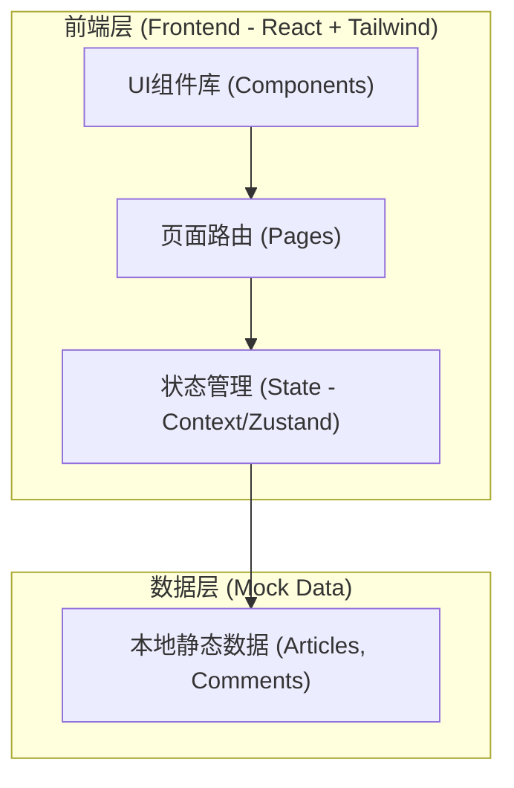

# 个人博客网站技术架构文档

## 1. 架构设计


## 2. 技术栈说明
- **前端框架**：React@18 + Vite
- **样式方案**：TailwindCSS@3
- **动效与图标**：Framer Motion (实现科技感入场及交互动效), lucide-react (图标)
- **路由管理**：React Router v6
- **数据源**：由于主要是展示设计与交互，本期采用前端 Mock 数据模拟文章、点赞量和评论。

## 3. 路由定义
| 路由路径 | 页面名称 | 页面用途 |
|----------|----------|----------|
| `/` | 首页 | 展示热门文章、搜索框、标签筛选和文章列表 |
| `/post/:id` | 文章详情页 | 根据 ID 展示完整的文章内容和评论区 |

## 4. 核心数据接口 (TypeScript 定义)
前端通过 Mock 数据模拟以下接口模型：
```typescript
// 文章模型
export interface Article {
  id: string;
  title: string;
  excerpt: string;
  content: string;
  tags: string[];
  likes: number;
  date: string;
  author: string;
  coverImage?: string;
}

// 评论模型
export interface Comment {
  id: string;
  articleId: string;
  username: string;
  content: string;
  date: string;
}
```

## 5. 项目结构规划
```text
src/
├── components/       # 可复用组件 (Navbar, ArticleCard, CommentSection)
├── pages/            # 页面视图 (Home, ArticleDetail)
├── data/             # Mock 数据 (mockArticles, mockComments)
├── styles/           # 全局样式 (科技感主题配置、CSS变量)
├── App.tsx           # 路由配置入口
└── main.tsx          # 挂载点
```
