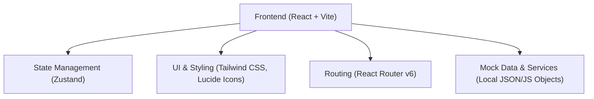

## 1. 架构设计


## 2. 技术栈说明
- **前端框架**: React@18
- **构建工具**: Vite
- **样式方案**: Tailwind CSS v3 (用于快速构建科技感深色主题、玻璃拟态、渐变发光等效果)
- **路由**: React Router DOM (用于实现首页与详情页之间的无缝切换)
- **状态管理**: Zustand (用于管理搜索关键字、选中的标签、评论数据等全局状态)
- **图标**: lucide-react (提供简洁现代的图标支持)
- **初始化工具**: vite-init (使用 `react-ts` 模板生成纯前端项目)

## 3. 路由定义
| 路由 | 用途 |
|-------|---------|
| `/` | 博客首页，包含顶部导航、热门文章推荐、搜索框、标签筛选和文章列表 |
| `/article/:id` | 文章详情页，展示完整文章内容以及底部的评论互动区 |

## 4. API 定义 (Mock 数据结构)
由于是纯前端展示项目，将使用本地 Mock 数据和 Zustand 来模拟后端交互。

```typescript
// 文章类型定义
export interface Article {
  id: string;
  title: string;
  summary: string;
  content: string; // 支持简单的 Markdown 格式或 HTML 字符串
  likes: number;
  tags: string[];
  date: string;
  readTime: string;
}

// 评论类型定义
export interface Comment {
  id: string;
  articleId: string;
  author: string;
  content: string;
  date: string;
}
```

## 5. 核心状态管理 (Zustand)
```typescript
interface BlogStore {
  articles: Article[];
  comments: Comment[];
  searchQuery: string;
  selectedTag: string | null;
  
  // Actions
  setSearchQuery: (query: string) => void;
  setSelectedTag: (tag: string | null) => void;
  addComment: (comment: Omit<Comment, 'id' | 'date'>) => void;
  likeArticle: (articleId: string) => void;
}
```
