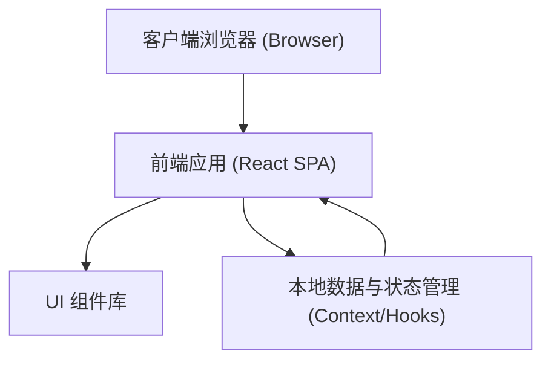
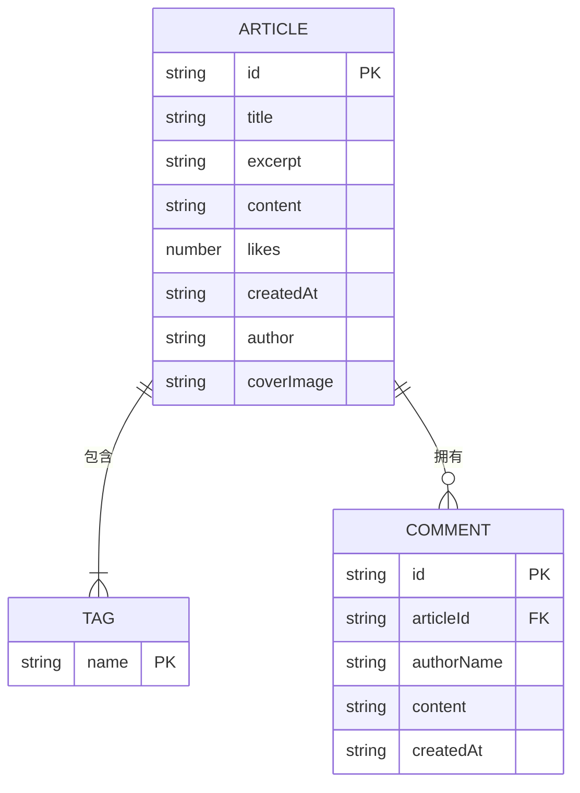

# 个人博客网站技术架构文档

## 1. 架构设计

本项目采用前后端分离的思想进行前端实现，后端数据采用本地模拟（Mock）或状态管理，整体架构主要由前端页面、组件以及数据模型组成。



## 2. 技术说明

- **前端框架**: React@18 (构建组件化单页应用)
- **样式方案**: Tailwind CSS@3 (用于快速实现科技感 UI 与响应式布局，利用自定义变量和 Utility classes)
- **构建工具**: Vite (极速开发体验)
- **路由管理**: React Router DOM (用于前端页面路由跳转，如 `/` 首页与 `/article/:id` 详情页)
- **图标库**: Lucide React (提供极简、未来感风格的图标)
- **动画库**: Framer Motion (用于页面切换过渡、卡片悬停的发光、淡入淡出等科技感动效)
- **状态管理**: React Hooks (useState, useMemo) 或 Context API（针对博客数据、搜索关键词、筛选标签进行管理）
- **数据存储**: 本地 Mock 数据 (模拟文章列表、评论及相关交互，避免后端依赖以快速上线展示)

## 3. 路由定义

| 路由路径 | 页面名称 | 页面用途 |
|----------|----------|----------|
| `/` | 首页 | 展示顶部导航、搜索框、标签筛选、最高点赞量文章和文章列表。 |
| `/article/:id` | 详情页 | 根据文章 ID 渲染完整文章内容，展示评论区并提供发表评论功能。 |
| `*` | 404 页面 | 处理未匹配的路由（可添加科技风的“信号丢失”提示）。 |

## 4. API 定义 (数据模拟结构)

为方便开发与后续扩展，此处定义博客文章和评论的数据结构：

### 4.1 博客文章数据 (Article)
```typescript
interface Article {
  id: string;
  title: string;
  excerpt: string;
  content: string; // Markdown 或 HTML 格式的长文本
  tags: string[];
  likes: number; // 用于首页热门排序
  createdAt: string; // "YYYY-MM-DD"
  author: string;
  coverImage?: string; // 科技感配图
}
```

### 4.2 评论数据 (Comment)
```typescript
interface Comment {
  id: string;
  articleId: string; // 关联的文章
  authorName: string; // 评论者昵称
  content: string; // 评论内容
  createdAt: string; // 评论时间
}
```

## 5. 数据模型定义

### 5.1 数据模型 (ER 图)



## 6. 开发环境要求
- **Node.js**: >= 18.0.0
- **包管理器**: npm, yarn 或 pnpm (推荐)
- **编辑器**: VSCode / Trae (推荐安装 Tailwind CSS IntelliSense 插件以辅助开发)
