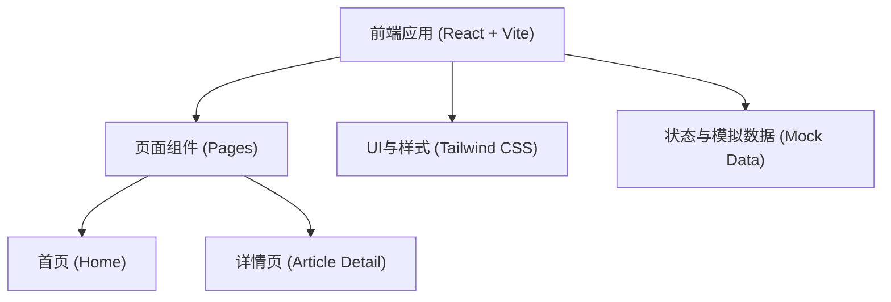
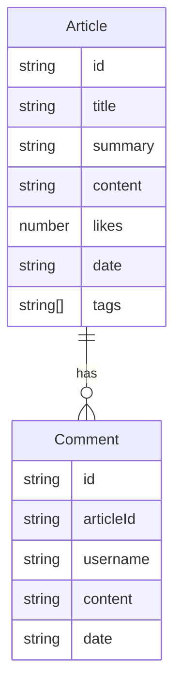

## 1. 架构设计

## 2. 技术说明
- **前端框架**：React@18 + Vite
- **样式方案**：Tailwind CSS @3（用于快速构建响应式及科技感暗黑系UI）
- **动画库**：Framer Motion（用于页面平滑切换、卡片发光悬浮等科技感微交互）
- **图标库**：lucide-react
- **路由管理**：react-router-dom
- **状态与数据**：由于是纯前端展示，使用本地模拟数据（Mock Data）和 React Context/State 来管理应用状态（如文章列表、搜索词、当前选中的标签、评论数据等）。

## 3. 路由定义
| 路由 | 用途 |
|-------|---------|
| `/` | 首页：包含搜索、标签筛选、热门文章及文章列表 |
| `/article/:id` | 详情页：完整展示对应ID的文章内容及评论区 |

## 4. 数据模型 (Mock Data)
### 4.1 数据模型定义

### 4.2 数据流设计
- 首页：读取 `Article` 数据源，通过计算找出点赞量最高的文章进行置顶推荐。同时根据用户输入的搜索关键字（匹配 title/summary）和选中的标签（tags）对列表数据进行过滤。
- 详情页：根据 URL 参数 `id` 查找对应的 `Article` 并展示完整 `content`。根据 `id` 查找 `Comment` 列表中 `articleId` 匹配的留言进行渲染。支持向 `Comment` 列表 push 新数据以模拟留言交互。
