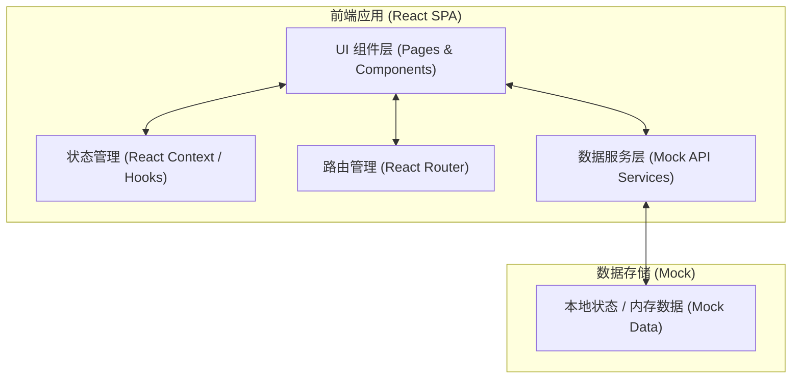
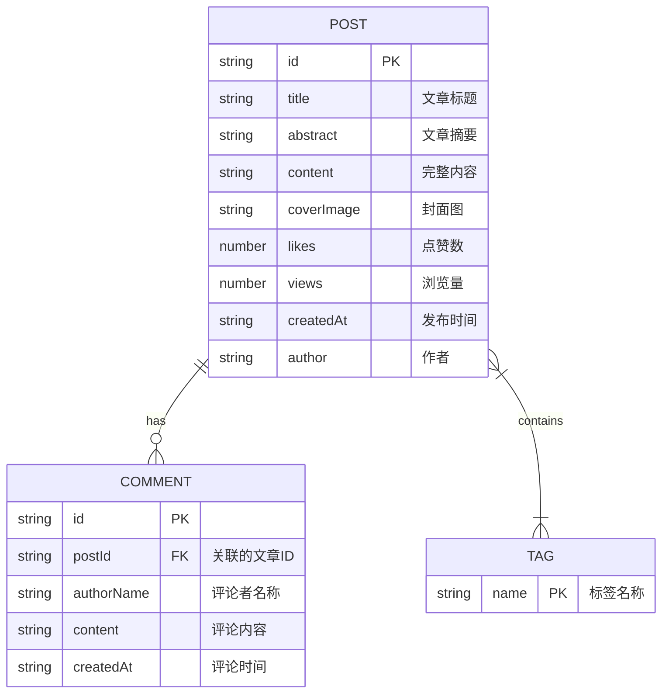

## 1. 架构设计
本项目为纯前端单页应用（SPA），使用 Mock 数据模拟后端接口以实现所需功能。



## 2. 技术说明
- **前端框架**: React 18 + Vite
- **路由**: react-router-dom v6
- **样式方案**: Tailwind CSS v3
  - 使用自定义的 Tailwind 配置扩展科技感颜色（如 `neon-blue`, `cyber-purple`）。
  - 自定义 CSS 用于实现高级的霓虹发光、扫描线动画和毛玻璃特效。
- **图标库**: lucide-react (轻量级，支持定制颜色和大小)
- **动画库**: framer-motion (用于页面切换、元素滚动出现、悬停发光等复杂科技感动效)
- **数据处理**: 本地预置 Mock 数据，通过异步函数模拟 API 请求。

## 3. 路由定义
| 路由路径 | 页面组件 | 用途 |
|-------|---------|---------|
| `/` | `Home` | 首页：展示顶部导航（含搜索）、热门文章、标签筛选及文章列表 |
| `/post/:id` | `PostDetail` | 详情页：展示文章完整内容、简洁导航及评论互动区 |

## 4. 数据接口定义 (Mock API)

前端将通过以下类型定义和模拟服务来获取和操作数据：

```typescript
// 文章类型定义
export interface Post {
  id: string;
  title: string;
  abstract: string;
  content: string; // 支持 Markdown 或 HTML 格式的字符串
  coverImage: string;
  tags: string[];
  likes: number;
  views: number;
  createdAt: string;
  author: string;
}

// 评论类型定义
export interface Comment {
  id: string;
  postId: string;
  authorName: string;
  content: string;
  createdAt: string;
}

// Mock API 服务
export interface ApiService {
  // 获取所有文章，支持可选的关键字和标签过滤
  getPosts(keyword?: string, tag?: string): Promise<Post[]>;
  // 获取点赞数最高的文章
  getTopLikedPost(): Promise<Post>;
  // 根据ID获取文章详情
  getPostById(id: string): Promise<Post | undefined>;
  // 获取文章的所有评论
  getCommentsByPostId(postId: string): Promise<Comment[]>;
  // 提交新评论
  addComment(postId: string, authorName: string, content: string): Promise<Comment>;
  // 获取所有可用标签
  getAllTags(): Promise<string[]>;
}
```

## 5. 数据模型
本地 Mock 数据的关系模型：


