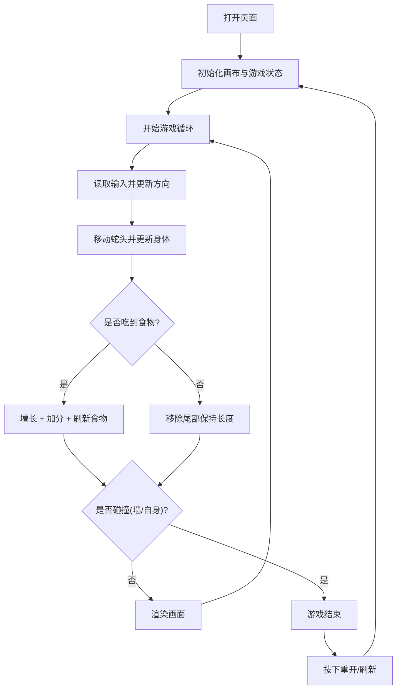

## 1. Product Overview
一个基于 HTML Canvas 的贪吃蛇小游戏，支持键盘控制、计分与失败重开，适合快速试玩与教学演示。
- 目标用户：想要轻量娱乐的用户、前端学习者
- 产品价值：零依赖、开箱即玩，代码结构清晰便于理解与扩展

## 2. Core Features

### 2.1 Feature Module
1. **游戏主界面**：Canvas 画布、分数显示、开始/重开提示
2. **核心玩法**：蛇移动、吃食物变长、碰撞判定、速度控制
3. **输入控制**：方向键 / WASD 控制，禁止瞬间反向

### 2.2 Page Details
| Page Name | Module Name | Feature description |
|-----------|-------------|---------------------|
| Game | Canvas Board | 使用网格绘制背景/蛇/食物，尺寸由 gridSize × tileCount 决定 |
| Game | HUD | 显示当前分数与状态（进行中/失败） |
| Game | Controls | 键盘输入方向，支持快速输入但不允许反向穿模 |
| Game | Game Loop | 固定 tick 更新移动与碰撞，重开时重置状态 |

## 3. Core Process
用户打开页面即可开始游戏，通过键盘控制蛇移动，吃到食物加分并增长，撞墙或撞到自己则游戏结束，可重新开始。

## 4. User Interface Design
### 4.1 Design Style
- 主色：深色背景 + 亮色蛇身（对比强、可读性高）
- 按钮/提示：轻量文本提示为主，避免遮挡画布
- 字体：系统等宽或无衬线字体，分数清晰可读
- 布局：顶部 HUD + 居中画布

### 4.2 Page Design Overview
| Page Name | Module Name | UI Elements |
|-----------|-------------|-------------|
| Game | HUD | 分数文本、状态提示（开始/结束） |
| Game | Canvas Board | 400×400 或按 gridSize×tileCount 动态尺寸、像素风网格感 |

### 4.3 Responsiveness
桌面优先，画布保持清晰比例；移动端可缩放容器并提供触控方向键（可选扩展）。
