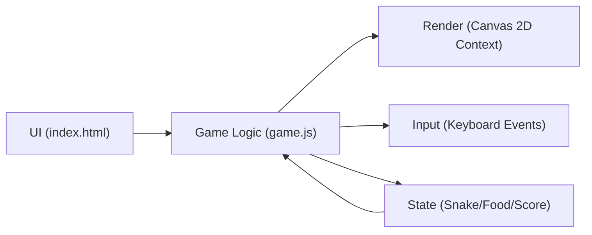
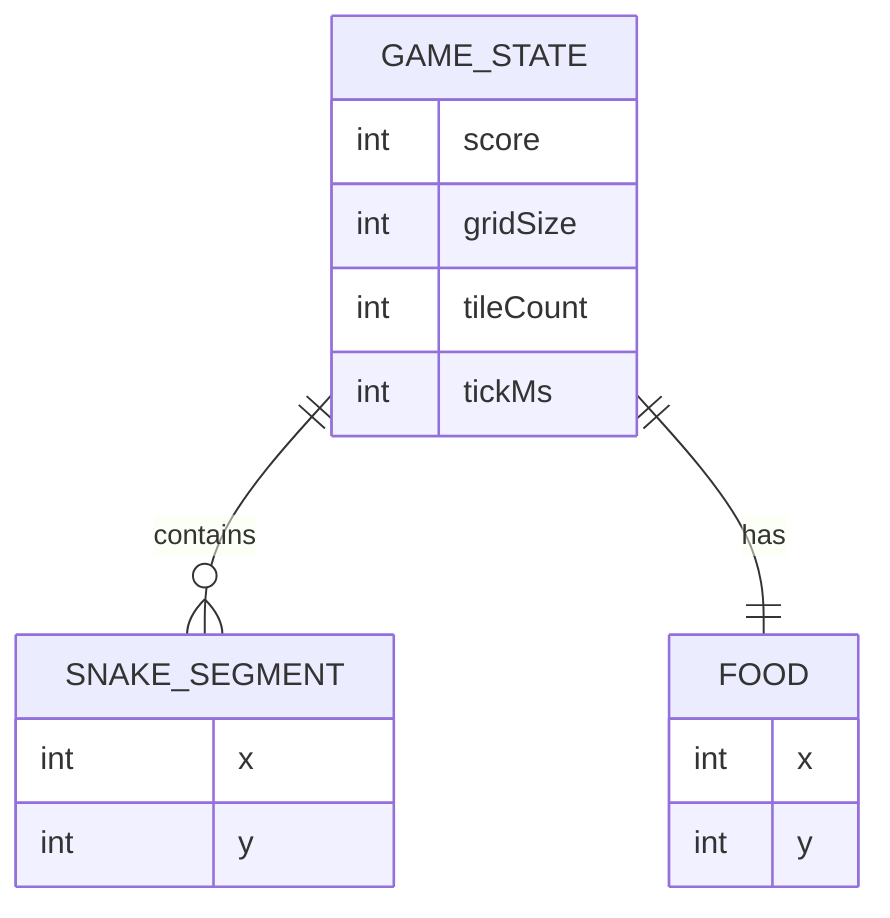

## 1. Architecture Design

## 2. Technology Description
- Frontend: 原生 HTML + CSS + JavaScript
- Rendering: Canvas 2D API
- Backend: None
- Data: 内存中的游戏状态（无持久化）

## 3. Route Definitions
| Route | Purpose |
|-------|---------|
| / | 单页运行贪吃蛇游戏 |

## 4. API Definitions (if backend exists)
不需要后端与 API。

## 5. Server Architecture Diagram (if backend exists)
不适用。

## 6. Data Model (if applicable)
### 6.1 Data Model Definition

### 6.2 Data Definition Language
不适用（无数据库）。
